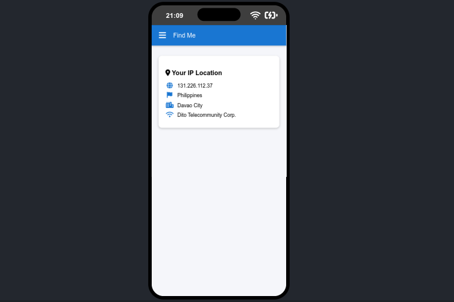

# FindMe

**FindMe** is a web application designed to detect and display the user's approximate location based on their IP address.

> [!NOTE]
> This app is intended for users who want to verify whether their public location (as shown by their IP) has changed — especially useful for people who use VPNs (for online games or other purposes). When a VPN is active, the app will show the VPN server's location, which can help you confirm that your connection appears to come from a different city or country.

## Description

The app uses the IP address to estimate the user's location by fetching data from the [ip-api.com](http://ip-api.com) API. Key data points that are displayed include:

- **IP Address**
- **Country**
- **City**
- **ISP (Internet Service Provider)**

**Important**: If the user is connected to a VPN, the location displayed will be based on the VPN server's location, not the user's actual physical location. This can cause the location data to appear as though the user is in a different city or country.

## Download the App

You can download the **FindMe** APK by clicking the link below:

[Download FindMe APK](./app/FindMe.Apk)
